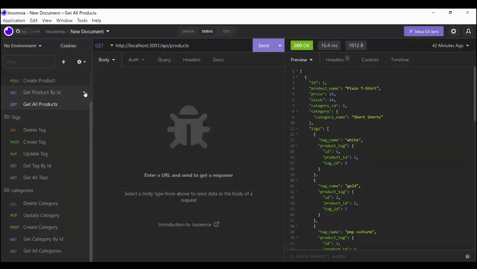
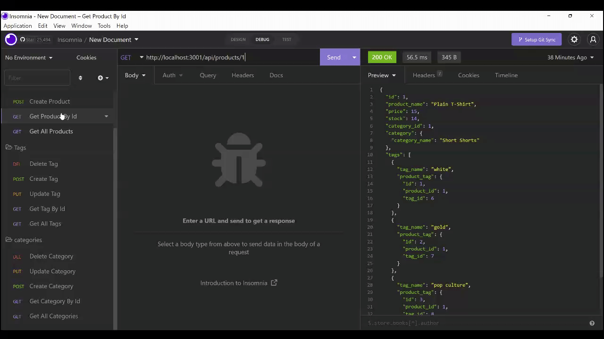
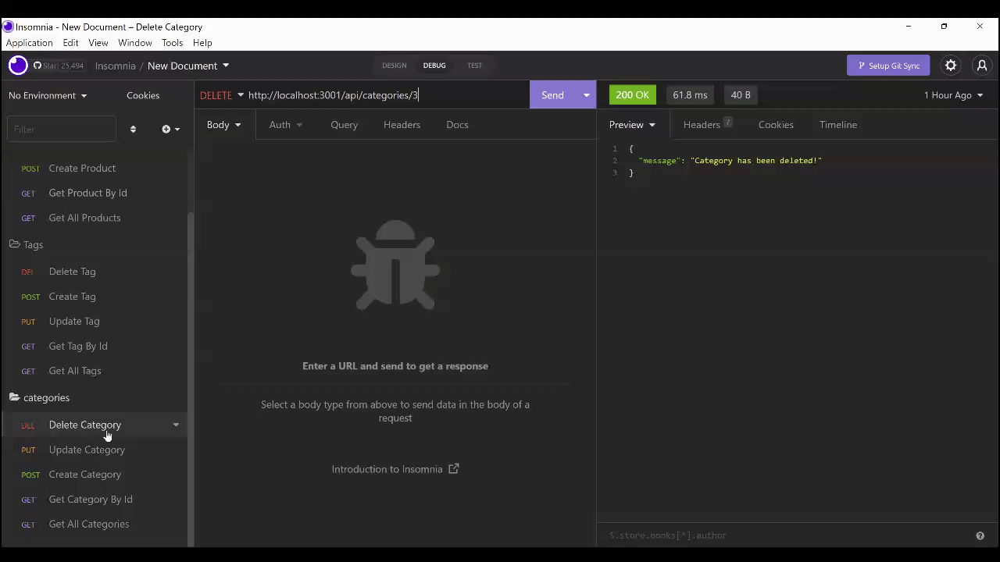

# 13 E-Commerce(Object-Relational-Mapping)

## Table Of Contents

- [Motivation](#Motivation)
- [Tools-Utilized](#Tools-Utilized)
- [Installation](#Installation)
- [Usage](#Usage)
- [License](#License)
- [Contribution](#Contribution)
- [Tests](#Tests)
- [Questions](#Questions)
- [Credits](#Credits)

## Motivation

The motivation for this project is to provide users with a convenient and efficient way to store/update/add/delete products in their database. Being provided the front-end code for this project, my main objective is to write the back-end code and create a connection between them.

In completing this project, I have learned the basic concepts of MySQL, Sequelize, and Express.js. I have also learned the benefits of utilizing modular routes to maintain cleaner code.

## Video Demonstration

[EcommerceSetUp](https://drive.google.com/file/d/1xMe6TUwGp2FD93QDk76aAZLfDgJr5pvC/view?usp=share_link)
[ECommerceGetAllAppDemo](https://drive.google.com/file/d/1hvn0i3jMBF8zJKX9O1bo7Bucuq9FRXka/view?usp=share_link)
[ECommerceGetSingleAppDemo](https://drive.google.com/file/d/1fLsvEW7eB27IdVjoArSn8mY-lGlMLAxK/view?usp=share_link)
[EcommercePUTPOSTDELAppDemo](https://drive.google.com/file/d/100ZDGh2TyMVxuwG5m_9MYZZ9YhRmjIYm/view?usp=share_link)

## Tools Utilized

## Installation

This application requires Express, Sequelize, MySQL2, Dotenv, and Insomnia to check the inventory.

## Usage

User will fork or download code and open in text editor of their choice. Once all packages are installed, User will run program and then check the data through insomnia. User will be able to create/add/update/delete inventory and see the changes reflected through insomnia.

## License

Licensed under the [ISC](https://opensource.org/licenses/ISC) license

## Contribution

Provide any suggestions to the email listed below.

## Tests

To run this application, tests are not required.

## Questions

_Any questions please contact me through email_

cwalk280@yahoo.com

## Credits

Resources of significance:

Special thanks to [Ileriayo Adebiyi](https://github.com/Ileriayo/markdown-badges#testing) and [Lucas Himsel](https://gist.github.com/lukas-h/2a5d00690736b4c3a7ba) for their public library of common badges
